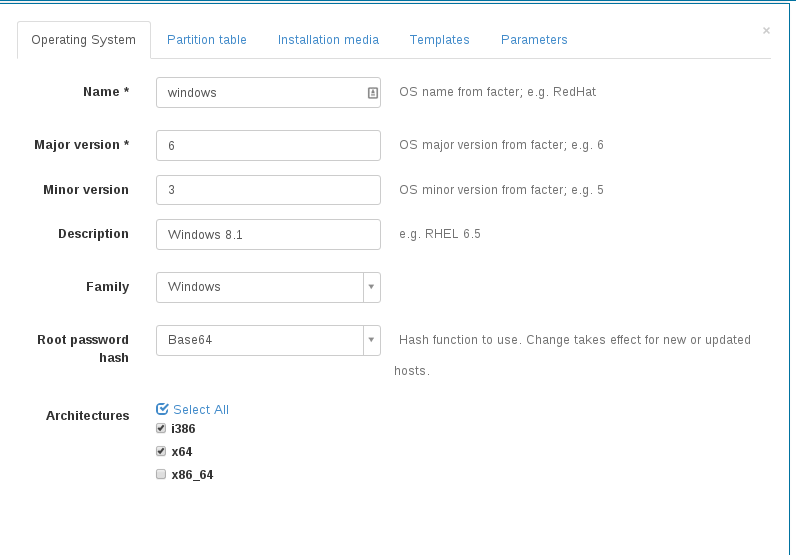
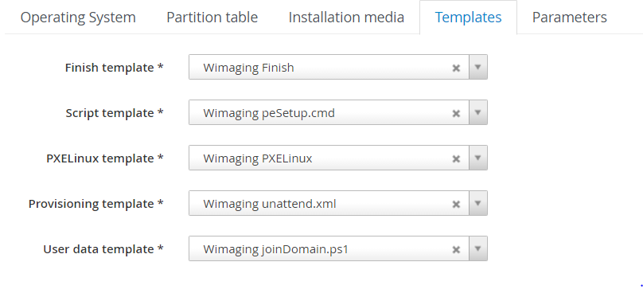

# Configuring Foreman
Now as you have your WIM images ready, it's time to configure your foreman installation. Make sure you meet the prerequisites.

### Tasks break down
- Download wimboot
- Change / add a new Architecture and OS
- Add provision templates
- Add installation media
- Add partition table
- Add parameters
- Link provisioning templates to OS
- Do a lot of testing

## I. Download wimboot
Start simple:
- Add [wimboot](http://git.ipxe.org/releases/wimboot/wimboot-latest.zip) bootloader to `/var/lib/tftpboot/boot/` on your PXE server.

## II. Architecture and OS
In _Hosts -> Architectures_ add a new architecture:

- Name: `x64`

Add a new OS in _Hosts -> Operating systems_ if needed.
If you already have windows hosts and puppet, the correct OS and architecture have been auto created already.
This example covers Windows 8.1 / Windows Server 2012R2.



- Name: `windows`
- Major: `6`
- Minor: `3`
- OS family: `windows`
- Description: `Windows8`
- Root password hash: `Base64`
- Architectures: `x64`

### Root passwords and encoding
Take special care to __Root password hash = `Base64`__. The templates do not render correctly if this is set otherwise.
Also, changing the encoding does not [apply do existing hosts](http://theforeman.org/manuals/1.9/index.html#3.5.2ConfigurationOptions)

## III. Add provision templates
Head to _Hosts -> Provisioning Templates -> New_ and create a template for each of the files in `./foreman`.
You can copy / paste them or upload the file. Assign each of those templates to your Windows OS (does not apply to snippets).
The naming of the templates is a suggestion and up to you. Keep in mind, this does __not__ apply to snippets! There, the name is important.

Since it is very likely you will need to edit these templates to your needs read about [Foreman Template Writing](http://projects.theforeman.org/projects/foreman/wiki/TemplateWriting)

### Required templates
#### Wimaging Finish
- Name: `Wimaging Finish`
- Kind: `finish`

#### Wimaging unattend.xml
- Name: `Wimaging unattend.xml`
- Type: Provision

#### Wimaging peSetup.cmd
- Name: `Wimaging peSetup.cmd`
- Kind: `script`

__Note:__ To get the download folders nicely, the [`wget64.exe`](https://www.gnu.org/software/wget/manual/wget.html) commands in this template might need tweaking. This could
especially be necessary if you intend to use the `extraFinishCommands` snippet.
Eg, `--cut-dirs=3` would cut the first three directories form the download path when saving locally.
This way `http://winmirror.domain.com/pub/win81x64/extras/puppet.msi` will be stripped of `pub/win81x64/extras` and download to `puppet.msi`.

#### Wimaging PXELinux
- Name: `Wimaging PXELinux`
- Kind: `PXE Linux`

### Optional templates
#### Wimaging joinDomain.ps1
- Name: `Wimaging joinDomain.ps1`
- Kind: `user_data`

#### Wimaging local users
- Name: `Wimaging local users`
- Kind: Snippet

__Note:__ This snippet creates extra users in the unattended stage.
This may be very useful for debugging early stages of your deployment; since you
can find yourself locked out of the newly provisioned host.

Microsoft did not really care for passwords in unattend.xml files; so it does not really matter if you use
`<PlainText>true</PlainText>` or not.
If you want to disguise your password, you could add a host parameter `localUserPassword` and use the following ruby/erb function with `<PlainText>false</PlainText>`:

```ruby
<%= Base64.encode64(Encoding::Converter.new("UTF-8", "UTF-16LE",:undef => nil).convert(@host.params['localUserPassword']+"Password")).delete!("\n").chomp -%>
```

Note,  the string `Password` is appended your passwords. You can try this out with by generating an unattend.xml containing local users using WAIK.

#### Wimaging extraFinishCommands
- Name: `Wimaging extraFinishCommands`
- Kind: Snippet

__Note:__ The commands here are executed at the last stage just before finishing host building.
Make sure they get executed in a synchronous way (eg. do not run in background like msiexec).
Otherwise the following reboot might kill them.

#### Wimaging OU from Hostgroup
- Name: `Wimaging OU from Hostgroup`
- Kind: Snippet

__Note__: This snippet may be used to generate the computer OU from the host's hostgroup and domain.

Example: Imagine host `example` in domain `ad.corp.com` and in hostgroup `servers/windows/databases`.
The snippet generates the OU path:
`OU=databases,OU=windows,OU=servers,DC=ad,DC=corp,DC=com`. Optionally, set the host parameter `computerOuSuffix` to add some arbitrary OU at the end.

## IV. Add installation media
For each of your Windows versions add a new installation media pointing to the root of the folder.
Eg, `http://winmirror.domain.com/pub/win81x64`. Assign them to your operatingsystem.

## V. Add partition table
Add the diskpart script from `./foreman/wimaging_partition_table.erb` as new partition table. Assign it to your windows OS.

## VI. Define templates
Link all the created templates as well as the installation media and partition table to the OS:

- Head to your OS, then provisioning
- Select the template from each kind from the drop down list
- In partition tables, select `Wimaging default`
- In installation media, check the appropriate installation media added above.



## Add Parameters
To render the the templates correctly, some parameters need to be added. The can be globals, or put them on
a hostgroup. Most of them make the most sense as parameter on the the OS. Also, almost none are
required and have defaults. For the most up to date desciption see the template itself.

### Important parameters
#### Required
- `windowsLicenseKey`: Valid Windows license key or generic KMS key
- `windowsLicenseOwner`: Legal owner of the Windows license key
- `wimImageName`: WIM image to install from a multi image install.wim file.

#### Optional
The following parameters are only applied if they exist. Some, like `domainAdminAccount` and `domainAdminAccountPasswd` require each other, tough.
- `systemLocale`: en-US
- `systemUILanguage`: en-US
- `systemTimeZone`: Pacific Standard Time - see [MS TimeZone Naming](https://msdn.microsoft.com/en-us/library/ms912391%28v=winembedded.11%29.aspx)
- `localAdminiAccountDisabled`: false - will keep the local administrator account disabled (default windows)
- `ntpSever`: time.windows.com,other.time.server - ntp server to use
- `domainAdminAccount`: administrator@domain.com - use this account to join the computer to a domain
- `domainAdminAccountPasswd`: Pa55w@rd - Password for the domain Admin account
- `computerOU`: OU=Computers,CN=domain,CN=com - Place the computer account in specified Organizational Unit
- `computerOuSuffix`: Used if `computerOU` is not present to generate the computer OU from hostgroup and hostdomain. `computerOU` takes precedence! Note, the OU must still be manually created in active directory.
- `computerDomain`: domain.com # domain to join

## VII. Testing and Troubleshooting
The templates most likely need a lot of testing to work. This is not covered here; though some hints how to start. You should proceed in this order:

1. __Get your templates to render correctly__. Create a random `Bare Metal` host in the desired hostgroup for this purpose and make extensive use of foreman's excellent template __Preview__.
2. __Continue testing with VMs__ to test netbooting and basic installation
3. __Debug `peSetup.cmd`__ by pausing it at the send (remove the comment from `::PAUSE`). Then, use `Ctrl-C` to cancel the script altogether. This way you can debug the rendered `peSetup.cmd` quite nicely in WinPE (eg, `notepad peSetup.cmd`)
4. Use a manually installed host to test rendered snippets like `WAIK extraFinishCommands` directly.
4. __Examine `C:\foreman.log.`__ - the output left from the finish script. Also, comment out the clean up stage in the finish script to examine and test the rendered scripts directly.
