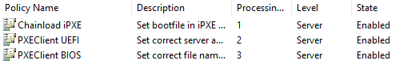
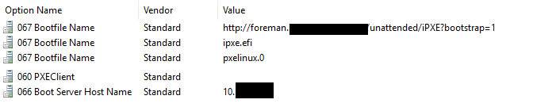

# Netbooting UEFI and Legacy BIOS clients using Windows DHCP

## Abstract
This tutorial aims to set up netbooting with foreman-discovery on a Windows DHCP server to provision Windows and Linux hosts
alike. The final setup will automatically discriminate between UEFI and Legacy hosts.

### Fair Warnings
- This setup is an **example**; it may not work for you and YMMW. I experienced a few pitfalls which I will
mention briefly in the context.
- I deliberately choose to use [iPXE](http://ipxe.org) as I need [wimboot](https://ipxe.org/wimboot)
for my Windows hosts and wimboot refused to work with either UEFI PXE and Grub2 (though it works fine with BIOS PXE).
- I had no issues so far with a broad range of hardware, but **iPXE might not support your network hardware** because of missing drivers.
- **Using iPXE prevents the use of Secure Boot** - this needs to be turned off in firmware settings.
- This guide only covers IPv4.

## Prerequisites
This guide assumes you are familiar with Foreman and have it running in your env already to provision hosts, following the setup
guides on . If you use foreman-discovery, I also assume this is working for you.
- A working Foreman 1.20+ installation, in this example `foreman.lan`, resolving to `10.10.10.10`. The links down below to foreman ui use this
name as well (copy and replace it for your needs!)
- Statements like "it works" are only true for my env (Enterprise Linux/Windows)
- Windows DHCP server, running foreman-proxy-dhcp (obviously) with the correct DHCP options to netboot/provision hosts
- Legacy BIOS as well as UEFI hardware (to test things)
- I did not bother with 32bit arch-hosts. However, setting this up should be rather simple and just requires an additional DHCP policy.
- Network install media (http or ftp) - in case of Windows, the install disk is basically copied to a network location keeping
the same folder structure (esp. for the `boot/` and `sources/` folders) - in case of Windows this is called `images.lan/win10`.

## Setup

### Compile and setup iPXE
Let us start with the easy part, compile the current iPXE EFI binary from source:
```text
$ git clone git://git.ipxe.org/ipxe.git && cd ipxe/src
$ make bin-x86_64-efi/ipxe.efi
$ scp bin-x86_64-efi/ipxe.efi root@foreman.lan:/var/lib/tftpboot/
```

### Prepare Wimboot
Copy the current version of wimboot (there was no new version since 2017, but check yourself) to your installation media's boot/ diretory:
```text
$ curl https://git.ipxe.org/release/wimboot/wimboot-2.6.0-signed.tar.gz | tar xzf -
$ scp wimboot-2.6.0-signed/wimboot root@images.lan:/win10/boot/
```

#### Caveats
In my case I needed FTP support. This is not turned on by default, as many other options which might be useful for you. In my case,
 I just edited the header file `src/config/general.h` set `#define        DOWNLOAD_PROTO_FTP`; then run make.
 There are a lot of useful options here, I encourage to have a look at the [build config docs](https://ipxe.org/buildcfg).

### Enable http listen and httpboot in Foreman-proxy
On your Foreman Proxy with the netboot/TFTP role, enable HTTP boot by running foreman-installer:
```text
# foreman-installer --foreman-proxy-http \
                    --foreman-proxy-http-port 8000 \
                    --foreman-proxy-httpboot \
                    --foreman-proxy-httpboot-listen-on both
```

Do a simple function test by downloading our `ipxe.efi` file:
```text
$ wget http://foreman-proxy.lan:8000/httpboot/ipxe.efi
```

If this is not working, check your proxy's config, it should look like this:

```text
# /etc/foreman-proxy/settings.d/httpboot.yml
---
# Enable publishing of a given directory under /EFI and /httpboot paths.
# Directory listing is not possible, symlinks are followed but not outside
# of the root directory specified in this file.

# Enables the module, make sure to enable TFTP module as well to allow
# configuration files deployment.
:enabled: true

:root_dir: /var/lib/tftpboot
```

For more details, please read [Lukáš Zapletal's Intro](https://community.theforeman.org/t/discovery-ipxe-efi-workflow-in-foreman-1-20/13026)
on Foreman's iPXE handling.

#### Caveats
- If you already have a service on your netboot proxy listening on port 8000 (the default), change the port in the above command.
In this case, you'll also have to clone and modify your [global default ipxe template](https://foreman.lan/templates/provisioning_templates/227-iPXE%20global%20default/edit)
and correct the port number there (also see next step).
- By default iPXE does **not support HTTPS**.

### Setup Foreman Templates
In your Foreman instance:
- Assign the the correct iPXE templates to your Linux OS's (ie, assign ``)
- Modify all your Operating systems to use the correct template
- In settings, make sure the [Global default iPXE template](https://foreman.lan/settings?search=global+ipxe) is selected
- For windows, create a new iPXE template and assign it to your windows OS:

```ruby
<%#
kind: iPXE
name: WAIK default iPXE
-%>
#!ipxe
kernel <%= medium_uri -%>/boot/wimboot
initrd <%= medium_uri -%>/boot/bcd      BCD
initrd <%= medium_uri -%>/boot/boot.sdi boot.sdi
initrd <%= medium_uri -%>/sources/boot.wim boot.wim
boot
```

### Configure Windows DHCP server
Log in to your Windows machine running the DHCP server role. Open a Power Shell window with elevated privileges.

First, add these four classes to your DHCP server:
```powershell
Add-DhcpServerv4Class -Name "PXEClient:Arch:00007" -Type Vendor -Description "PXEClient (UEFI x64)" -Data "PXEClient:Arch:00007"
Add-DhcpServerv4Class -Name "PXEClient:Arch:00006" -Type Vendor -Description "PXEClient (UEFI x86)" -Data "PXEClient:Arch:00006"
Add-DhcpServerv4Class -Name "PXEClient:Arch:00000" -Type Vendor -Description "PXEClient (Legacy BIOS)" -Data "PXEClient:Arch:00000"
Add-DhcpServerv4Class -Name "iPXE" -Type User -Description "iPXE clients" -Data "iPXE"
```

Second, add the policies and set the correct options. Note, you need to set the actual option in the second step for each policy.
Note, this will set up these options as server defaults. If you need more fine grained control, use scope options. Please refer do
[the commandlet's docs](https://docs.microsoft.com/en-us/powershell/module/dhcpserver/add-dhcpserverv4policy?view=win10-ps)
```powershell
# iPXE client chanloads into bootstrap
Add-DhcpServerv4Policy -ProcessingOrder 1 -Name "chainload-ipxe" -Condition OR -UserClass EQ,iPXE
Set-DhcpServerv4OptionValue -PolicyName "chainload-ipxe" -OptionID 67 -Value "http://foreman.lan/unattended/iPXE?bootstrap=1"

# UEFI clients load iPXE
Add-DhcpServerv4Policy -ProcessingOrder 2 -Name "pxeclient-uefi64" -Condition OR -VendorClass EQ,PXEClient:Arch:00007*
Set-DhcpServerv4OptionValue -PolicyName "pxeclient-uefi64" -OptionID 67 -Value "ipxe.efi"

# Legacy clients just load usual pxelinix.0
Add-DhcpServerv4Policy -Name -ProcessingOrder 3 "pxeclient-bios" -Condition OR -VendorClass EQ,PXEClient:Arch:00000*
Set-DhcpServerv4OptionValue -PolicyName "pxeclient-bios" -OptionID 67 -Value "pxelinux.0"
```

Leave all current options untouched (boot server name, ect.). In the end, your policies and options should look like this (please note,
**I do not use** the policy names from the commands above, sorry for that):

#### Windows DHCP Policies


#### Windows DHCP Options


#### Caveats
- Windows DHCP policies work by applying the options from all matching policies
- If a specific option is set multiple times as in our case, the first match is applied. Since we need to boot *first*
to ipxe.efi and *then* ipxe configures the interface again, it is vital that policy `chainload-ipxe` **has a lower processing order** then
`pxeclient-uefi64`!
- Ensure to include the asterisk (\*) wildcard in the above conditions as the reported vendor classes as we only want to match
a common prefix (see debug section below)
- DHCP option 60 (PXEClient) has been removed it seems in Windows Server 2016+. It seems this option is not nesseary for Netboot
to work with Windows DHCP. If you add the option manually or use Windows 2012r2, make sure this option is set to **an empty string value**,
as anything else prevents netboot from working (refer to an existing reservation from Foreman)

#### Recommendations
- Since we covered all our bases I recommend to delete the scope/server default option 67 boot file. I found that policies
always take precedence over normal default options

### Debugging Windows DHCP
Your best bet is to monitor (ie, `tail -f`) the dhcp-server logs. By default you will find a log file for every weekday
(for example, `C:/Windows/System32/dhcp/DhcpSrvLog-Wen.log`)
```
11,07/15/20,13:21:20,Renew,10.10.10.104,,00012E846E35,,10615041,0,,,,0x505845436C69656E743A417263683A30303030373A554E44493A303033303130,PXEClient:Arch:00007:UNDI:003010,0x69505845,iPXE,0x0102001902060024A8D75E40,0
11,07/15/20,13:21:24,Renew,10.10.10.104,,00012E846E35,,411480855,0,,,,0x00,,0x69505845,iPXE,0x0102001902060024A8D75E40,0
11,07/15/20,13:24:29,Renew,10.10.10.104,,00012E846E35,,896435247,0,,,,0x505845436C69656E743A417263683A30303030303A554E44493A303032303031,PXEClient:Arch:00000:UNDI:002001,,,0x0102001902060024A8D75E40,0
```
You can see here:
1. A client first booted to UEFI x64 (PXEClient:Arch:00007:UNDI...)
2. The client's iPXE client request with user class `iPXE`
3. The last entry is the same client, but switched to legacy boot in firmware (PXEClient:Arch:00000:UNDI...)

### Conclusion
You now should have netboot working for UEFI *and* Legacy hosts at the same time. In my tests, anaconda/kickstart (EL) do the right
thing out of the box and setup UEFI boot when booted from UEFI and BIOS/MBR otherwise. In case of Windows, my ptable and script snippets are
below.
